# Week 3

## Assignment 1

### Question 1

select * from goal;
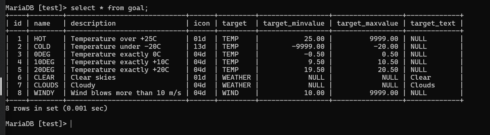

### Question 2

select name from airport where iso_country="FI";
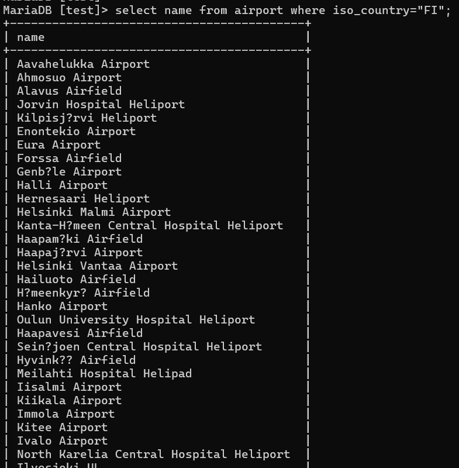

### Question 3

select name from airport where iso_country="FI" order by name asc;
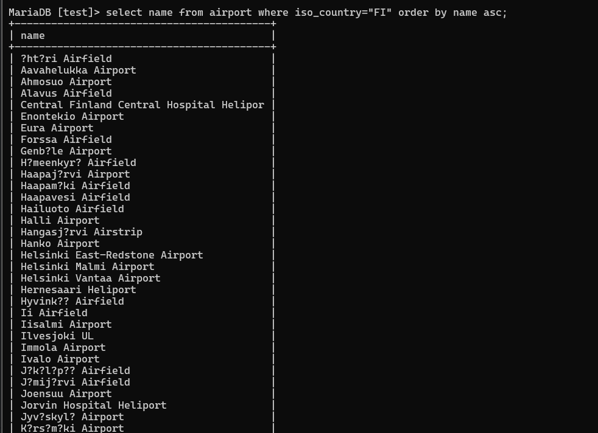

### Question 4

select name, type from airport where iso_country="FI" order by type asc, name asc;
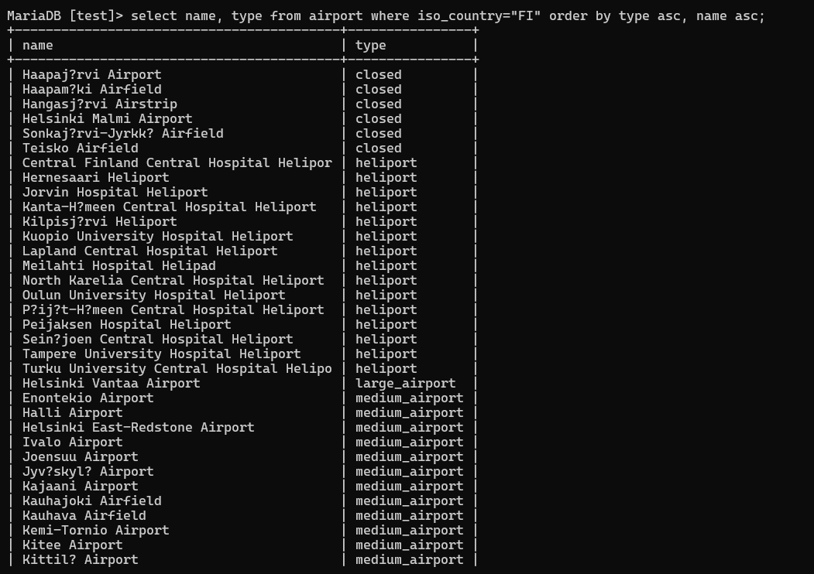

### Question 5

select name from country where name like "F%";

### Question 6

select name from country where name like "%F%";
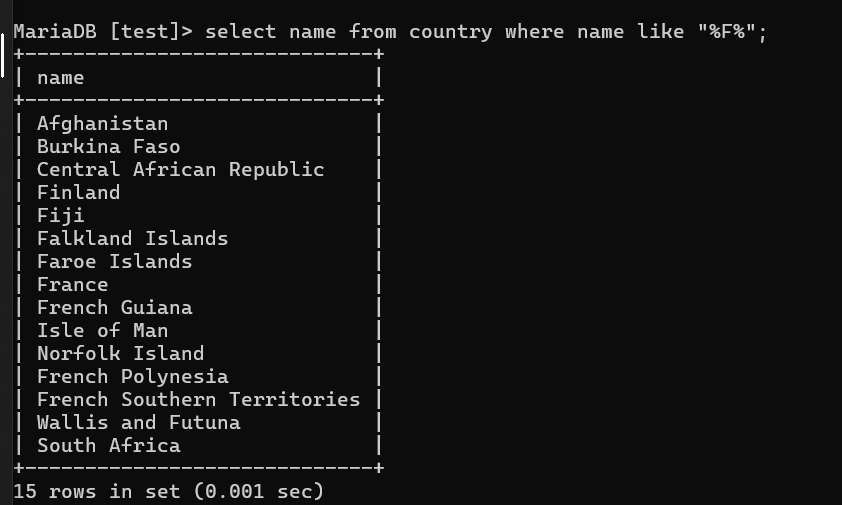

### Question 7

select location from game where screen_name='Vesa';
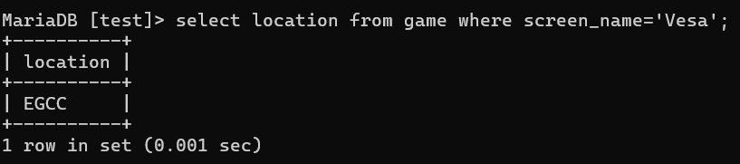

### Question 8

select co2_consumed from game where screen_name='Ilkka';
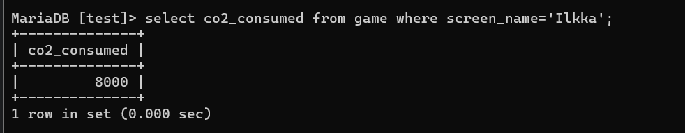

### Question 9

select co2_budget from game where screen_name='Ilkka';
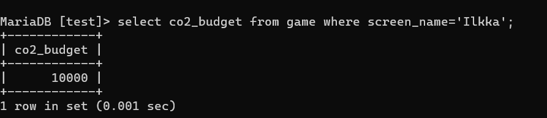
### Question 10

SET @co2_budget := (SELECT co2_budget FROM game WHERE screen_name = 'Ilkka');
SET @co2_consumed := (SELECT co2_consumed FROM game WHERE screen_name = 'Ilkka');
SET @co2_left := @co2_budget - @co2_consumed;

SELECT 'Ilkka' AS screen_name,
       @co2_budget AS co2_budget,
       @co2_consumed AS co2_consumed,
       @co2_left AS co2_left;

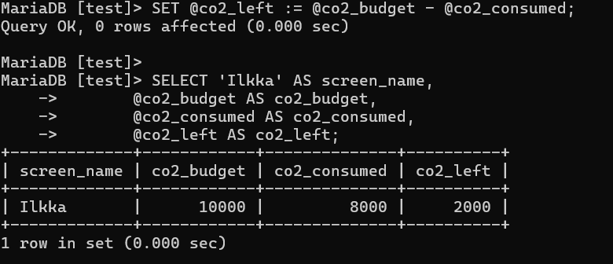
## Assignment 2

### Question 1
SELECT
    country.name AS "country name",
    airport.name AS "airport name"
FROM
    country
JOIN
    airport ON country.iso_country = airport.iso_country
WHERE
    country.name = 'Iceland';

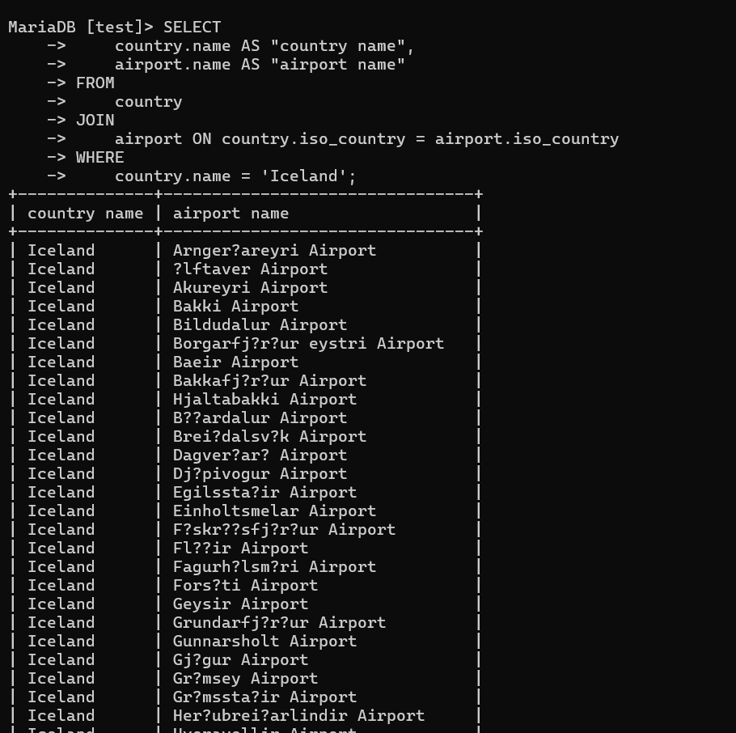

### Question 2

SELECT
    name AS "airport name"
FROM
    airport
WHERE
    type = 'large_airport';

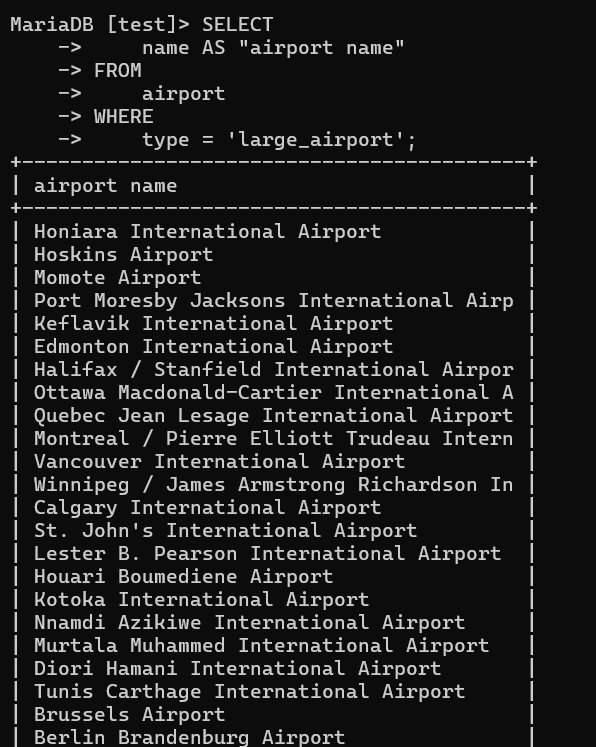
### Question 3

SELECT
    country.name AS "country_name",
    airport.name AS "airport_name"
FROM
    country
JOIN
    airport ON country.iso_country = airport.iso_country
WHERE
    country.continent = 'AN';

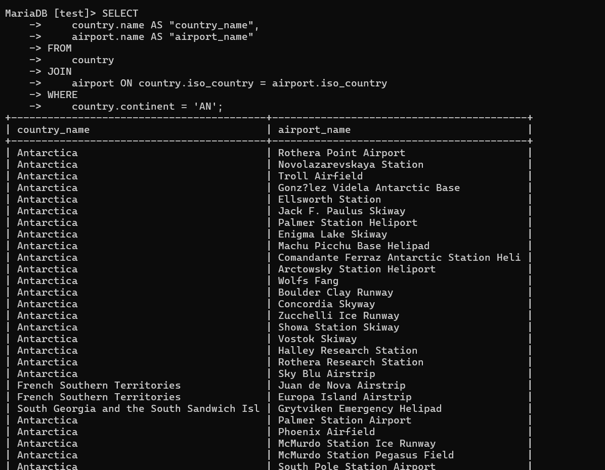
### Question 4

SELECT
    a.elevation_ft AS "elevation_ft"
FROM
    airport a
JOIN
    game g ON g.location = a.ident
WHERE
    g.screen_name = 'Heini';

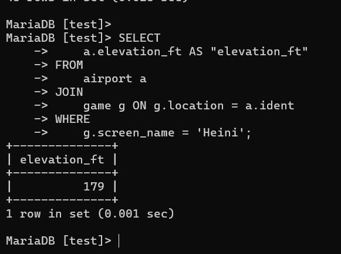

### Question 5

SET @elevation_ft_Heini := (
    SELECT
        a.elevation_ft
    FROM
        airport a
    JOIN
        game g ON g.location = a.ident
    WHERE
        g.screen_name = 'Heini'
);

SET @elevation_m_Heini := 0.3048 * @elevation_ft_Heini;

SELECT @elevation_m_Heini AS elevation_m;

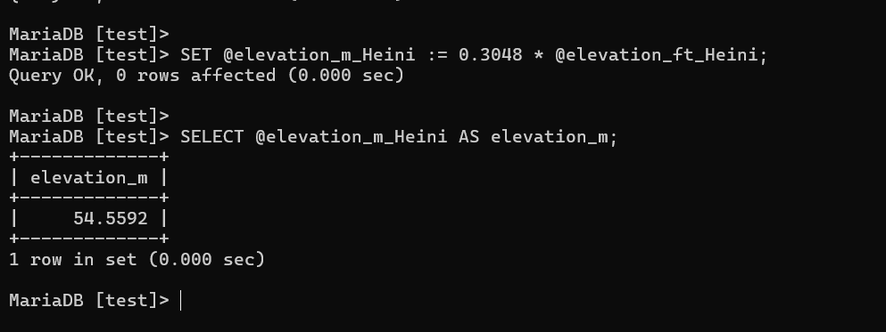
### Question 6
SELECT
    a.name AS "name"
FROM
    airport a
JOIN
    game g ON g.location = a.ident
WHERE
    g.screen_name = 'Ilkka';

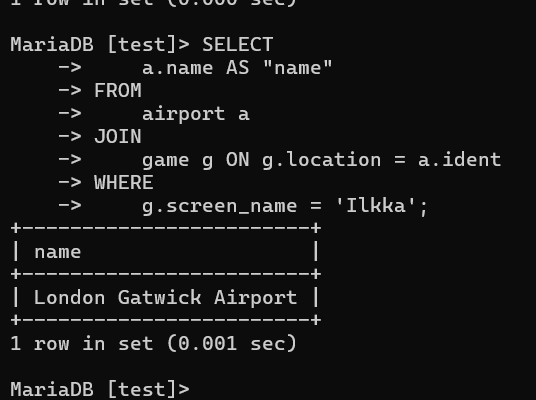
### Question 7
SELECT name
FROM country
WHERE iso_country = (SELECT iso_country
                     FROM airport
                     WHERE ident = (SELECT location
                                    FROM game
                                    WHERE screen_name = 'Ilkka'));
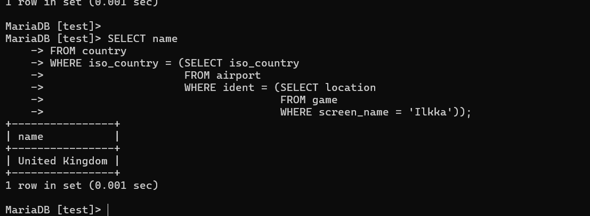
### Question 8
select name
from goal
where id in
            (select goal_id
             from goal_reached
             where game_id=
                   (select id from game where screen_name="Heini"));
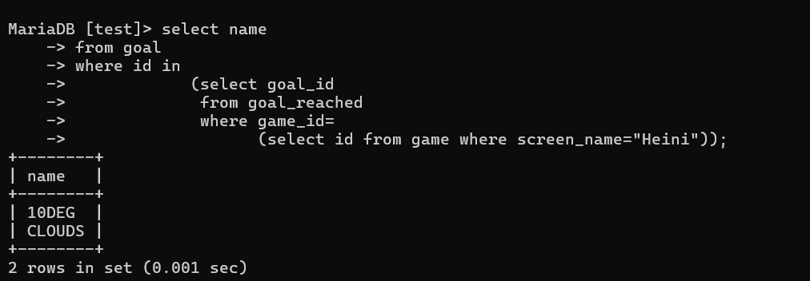
### Question 9

SELECT name
FROM airport
WHERE ident = (SELECT location
               FROM game
               WHERE screen_name = 'Ilkka');

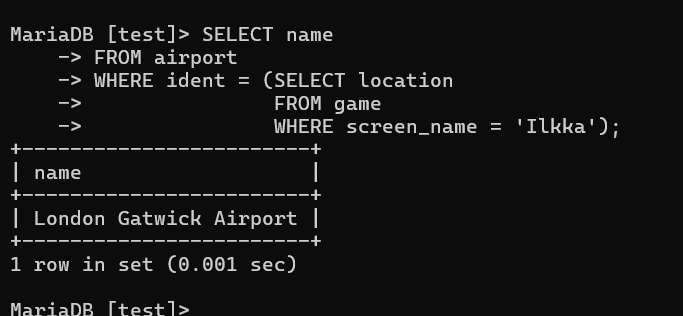
### Question 10

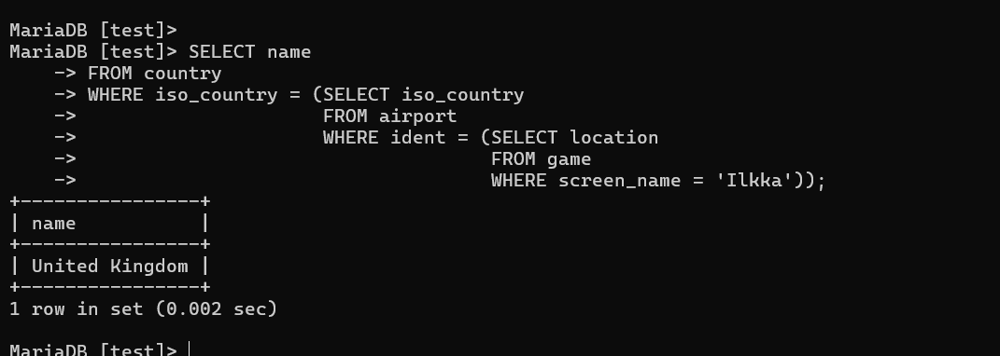