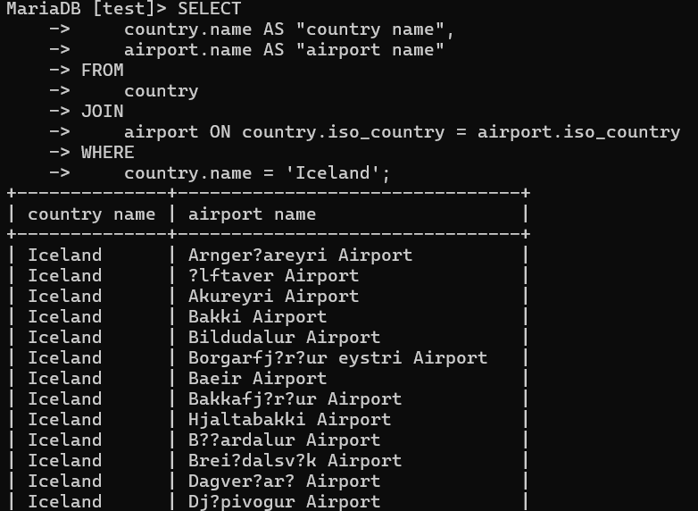

# Week 3

### Question 1
SELECT
    country.name AS "country name",
    airport.name AS "airport name"
FROM
    country
JOIN
    airport ON country.iso_country = airport.iso_country
WHERE
    country.name = 'Iceland';

