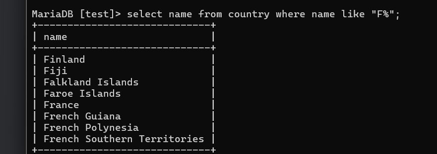

# Week 3

## Assignment 1

### Question 1

select * from goal;

### Question 2

select name from airport where iso_country="FI";

### Question 3

select name from airport where iso_country="FI" order by name asc;

### Question 4

select name, type from airport where iso_country="FI" order by type asc, name asc;

### Question 5

select name from country where name like "F%";

### Question 6

select name from country where name like "%F%";

### Question 7

select location from game where screen_name='Vesa';

### Question 8

select co2_consumed from game where screen_name='Ilkka';

### Question 9

select co2_budget from game where screen_name='Ilkka';

### Question 10

SET @co2_budget := (SELECT co2_budget FROM game WHERE screen_name = 'Ilkka');
SET @co2_consumed := (SELECT co2_consumed FROM game WHERE screen_name = 'Ilkka');
SET @co2_left := @co2_budget - @co2_consumed;

SELECT 'Ilkka' AS screen_name,
       @co2_budget AS co2_budget,
       @co2_consumed AS co2_consumed,
       @co2_left AS co2_left;

## Assignment 2

### Question 1
SELECT
    country.name AS "country name",
    airport.name AS "airport name"
FROM
    country
JOIN
    airport ON country.iso_country = airport.iso_country
WHERE
    country.name = 'Iceland';

### Question 2

### Question 3

### Question 4

### Question 5

### Question 6

### Question 7

### Question 8

### Question 9

### Question 10