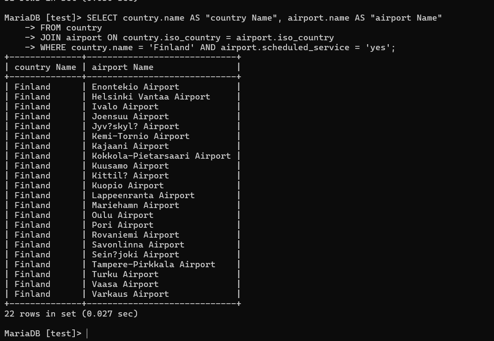
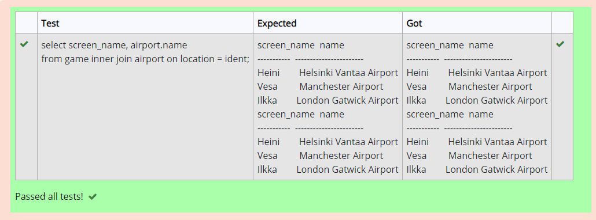
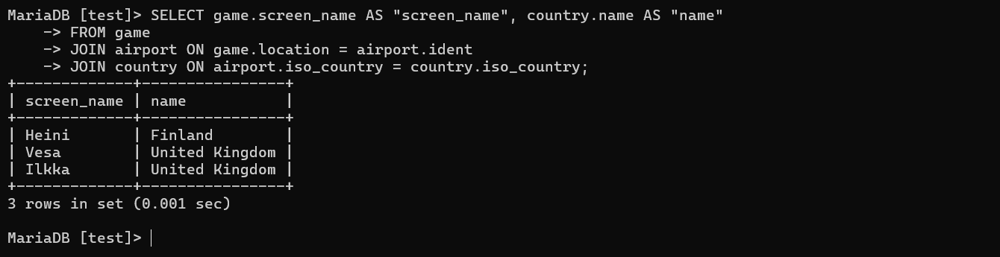
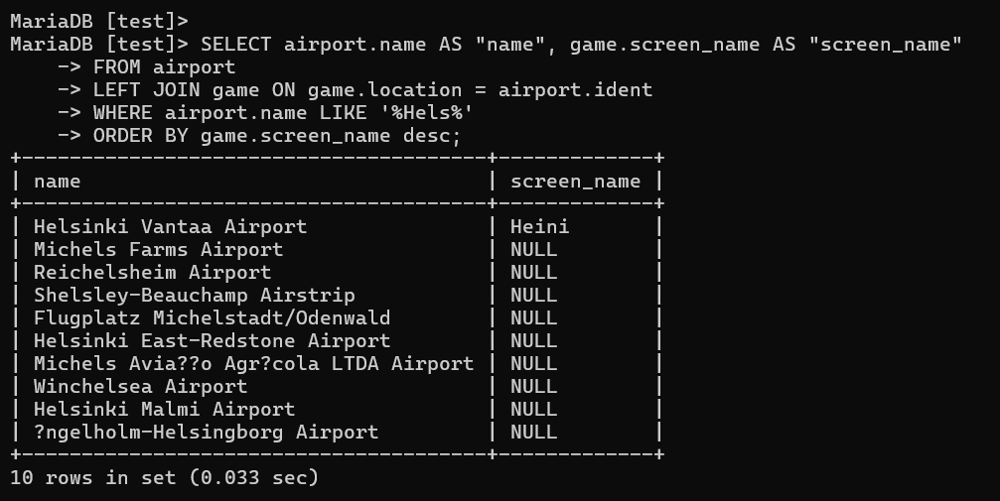
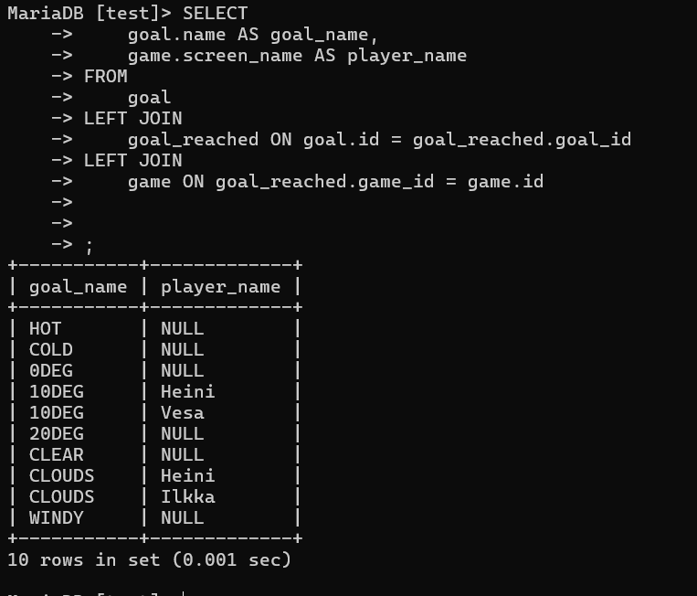
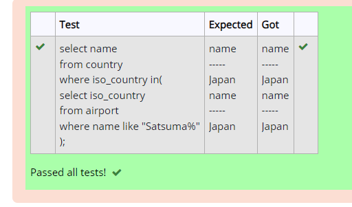
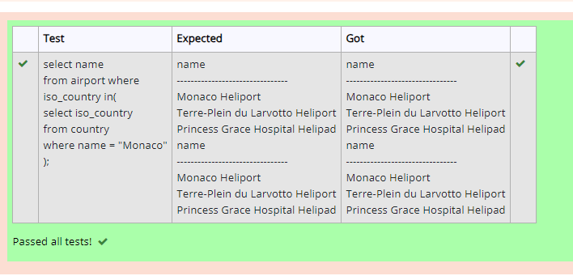
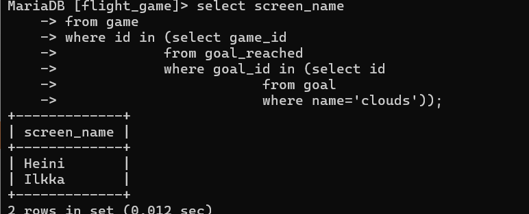
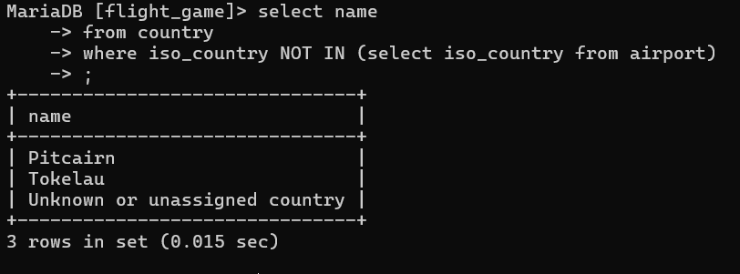
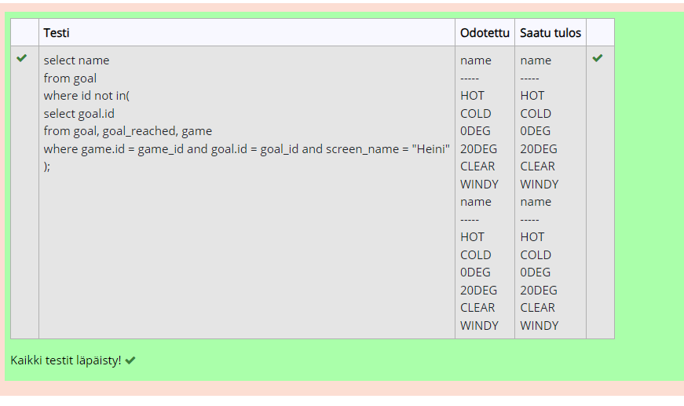

# Week 4

## Assignment 1

### Question 1

SELECT country.name AS "country name", airport.name AS "airport name"
FROM country
JOIN airport ON country.iso_country = airport.iso_country
WHERE country.name = 'Finland' AND airport.scheduled_service = 'yes';

### Question 2

SELECT game.screen_name AS "screen_name", airport.name AS "name"
FROM game
JOIN airport ON game.location = airport.ident;

### Question 3

SELECT game.screen_name AS "screen_name", country.name AS "name"
FROM game
JOIN airport ON game.location = airport.ident
JOIN country ON airport.iso_country = country.iso_country;

### Question 4

SELECT airport.name AS "name", game.screen_name AS "screen_name"
FROM airport
LEFT JOIN game ON game.location = airport.ident
WHERE airport.name LIKE '%Hels%'
ORDER BY game.screen_name desc;

### Question 5

SELECT 
    goal.name AS goal_name,
    game.screen_name AS player_name
FROM 
    goal
LEFT JOIN 
    goal_reached ON goal.id = goal_reached.goal_id
LEFT JOIN 
    game ON goal_reached.game_id = game.id;

## Assignment 2

### Question 1

select name
from country
where iso_country=(
            select iso_country
            from airport
            where name like "Satsuma%"
);

### Question 2

select name
from airport
where iso_country=
        (select iso_country
        from country
        where name="Monaco");

### Question 3

select screen_name 
from game
where id in (select game_id
            from goal_reached
            where goal_id in (select id
                        from goal
                        where name='clouds'));

### Question 4

select name
from country
where iso_country NOT IN (select iso_country from airport);

### Question 5

select name
from goal
where id not in (select goal_id from goal_reached where game_id in (select id from game where screen_name='Heini'));

