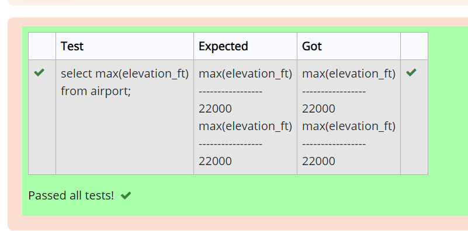
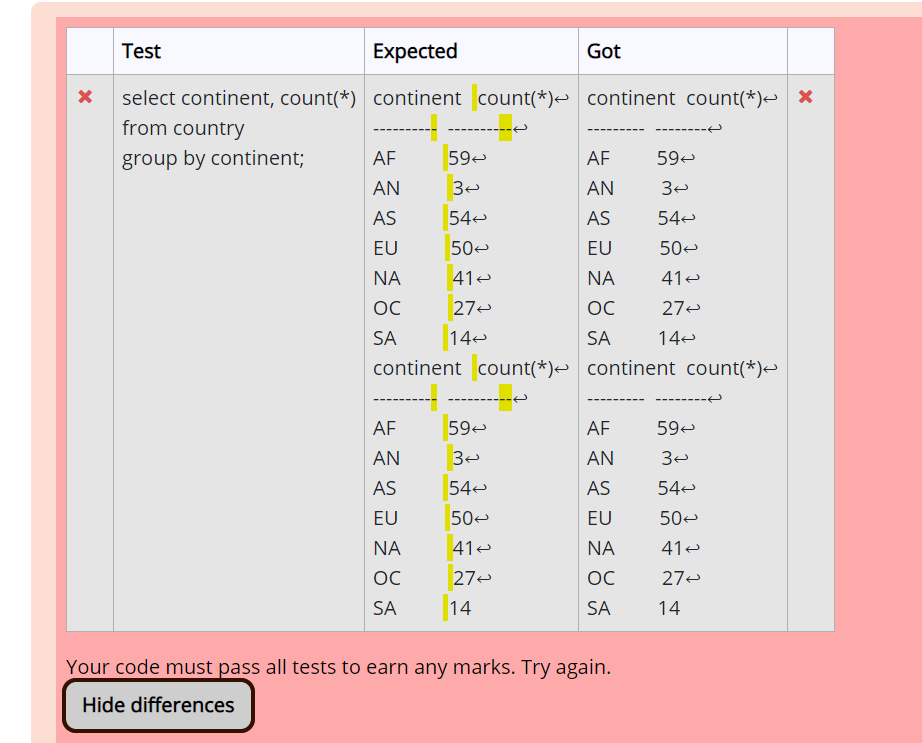
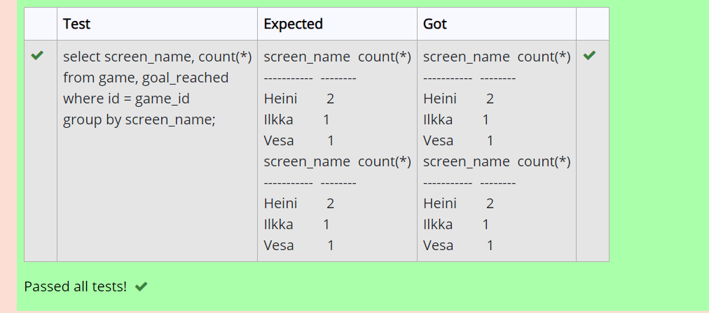
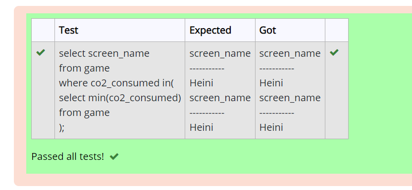
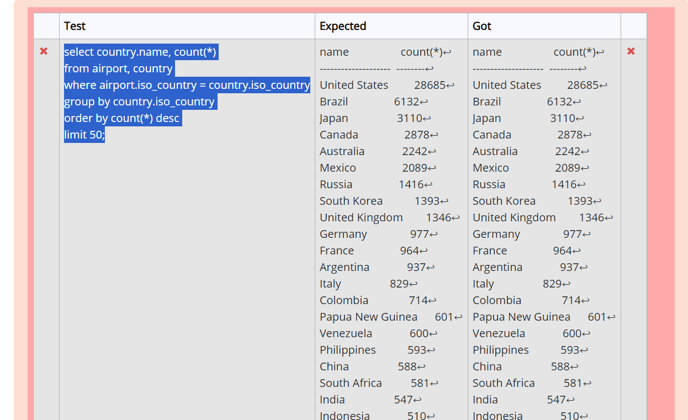
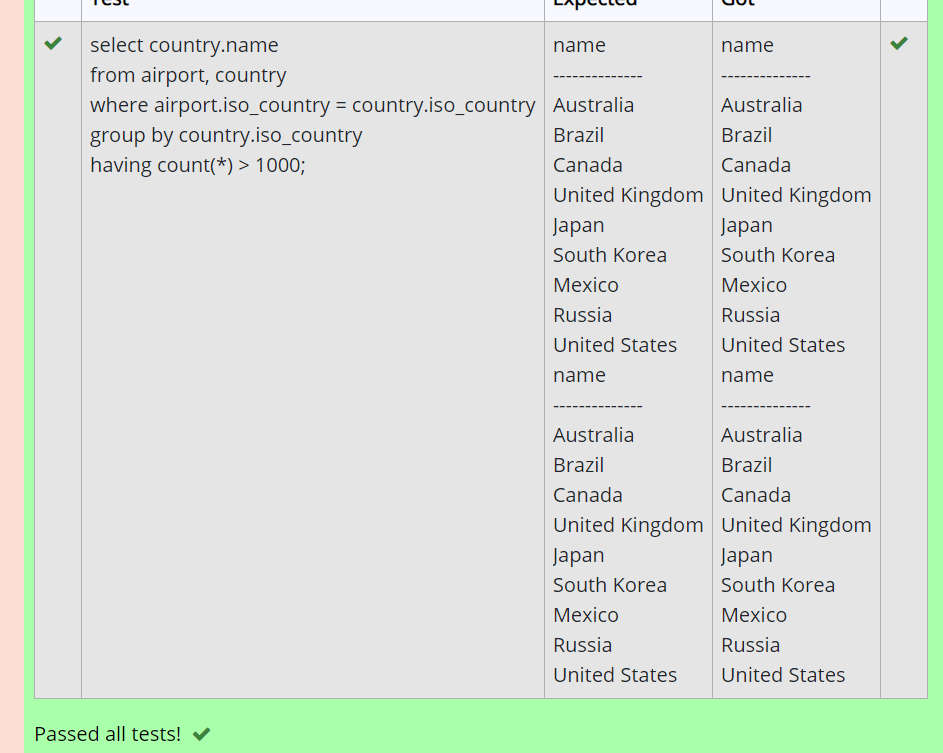
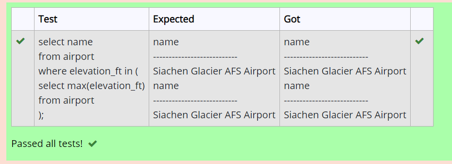
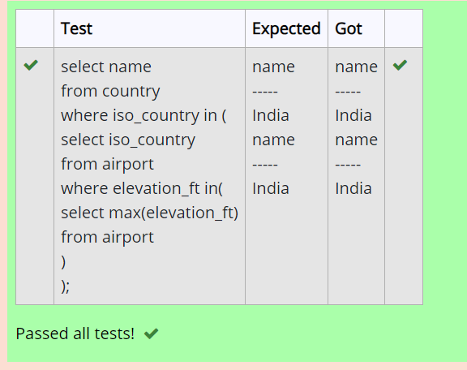
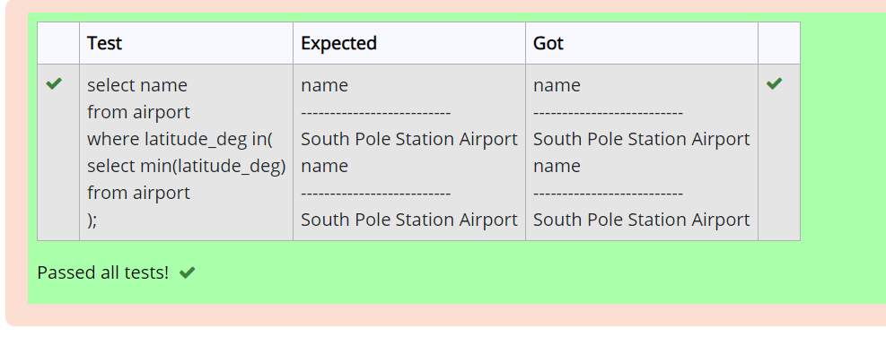

# Week 5

## Assignment 1

### Question 1

SELECT elevation_ft 
AS 'max(elevation_ft)' 
FROM airport 
WHERE elevation_ft in( 
                        SELECT max(elevation_ft)
                        FROM airport
                            );

### Question 2

SELECT continent, count(*) 
FROM country 
GROUP BY continent;

### Question 3

SELECT screen_name, count(*) 
FROM game, goal_reached 
WHERE game.id = game_id 
GROUP BY screen_name;

### Question 4

SELECT screen_name 
FROM game 
WHERE co2_consumed in
    ( 
        SELECT min(co2_consumed)
        FROM game
    );

### Question 5

	
select country.name, count(*)
from airport, country
where airport.iso_country = country.iso_country
group by country.iso_country
order by count(*) desc
limit 50;

### Question 6

SELECT country.name 
FROM airport, country 
WHERE country.iso_country = airport.iso_country 
GROUP BY country.iso_country HAVING count(*) > 1000;

### Question 7

SELECT name 
FROM airport 
WHERE elevation_ft in
    ( 
        SELECT max(elevation_ft)
        FROM airport
    );

### Question 8

SELECT country.name 
FROM airport,country 
WHERE 
    country.iso_country = airport.iso_country 
        AND
    elevation_ft in
                    ( 
                        SELECT max(elevation_ft) 
                        FROM airport
                    );

### Question 9

SELECT count(*) 
FROM goal_reached, game 
WHERE game.id = game_id 
        AND 
      screen_name = "Vesa";

### Question 10

SELECT name 
FROM airport 
WHERE latitude_deg in
    ( 
        SELECT min( latitude_deg ) 
        FROM airport
    );

